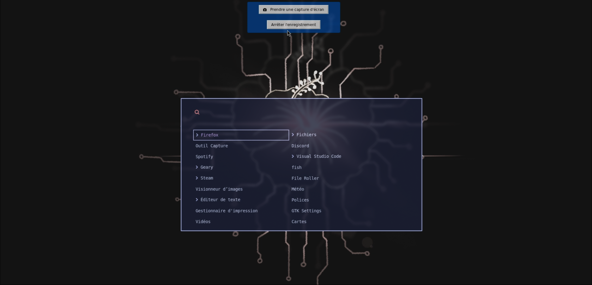

# My Dotfiles — Hyprland + NixOS

Welcome to my **dotfiles**.  
Yes, they are beautiful. Yes, they work (most of the time).  
And no, you *probably* shouldn't just copy-paste them — unless you enjoy debugging *other people's* bad ideas.

## What's inside?
- **NixOS** configs for a reproducible system
- **Hyprland** rice for maximum swooshy animations
- Assorted scripts and tweaks that only make sense to me

---

> **Disclaimer:**  
> Don't you dare steal my dotfiles!!  
> (Or do… but don't complain when your monitor catches fire.)

---

